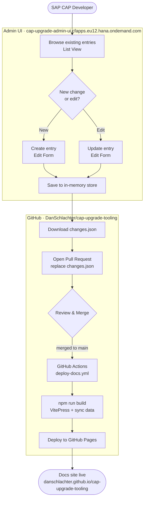
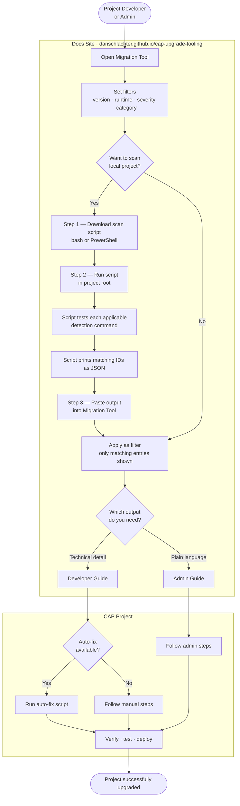

# CAP Comprehensive Upgrade Tooling

A two-part toolset that makes SAP CAP version upgrades smooth for both developers and non-technical administrators.

**Live sites**
- Docs site: https://danschlachter.github.io/cap-upgrade-tooling/
- Admin UI: https://cap-upgrade-admin-ui.cfapps.eu12.hana.ondemand.com

---

## How It Works

### Maintaining the knowledge base (CAP Developer)

A CAP expert discovers a breaking change, opens the Admin UI, creates or edits an entry, downloads the updated `changes.json`, and opens a PR. Once merged to `main`, GitHub Actions rebuilds and deploys the docs site automatically.



### Upgrading a CAP project (Developer / Admin)

Project teams open the Migration Tool on the docs site, filter by version and runtime, optionally run a generated scan script against their local project to identify which entries apply, then follow the Admin Guide (plain language) or Developer Guide (technical steps + auto-fix scripts).



---

## Repository Structure

```
/
├── changes.json                    Single source of truth — all breaking change entries
├── manifest.yml                    CF deployment manifest for admin-ui
├── .github/
│   └── workflows/
│       └── deploy-docs.yml         Build + deploy docs site on push to main
├── admin-ui/                       Vue 3 + Vite SPA — create and edit entries
│   └── src/
│       ├── views/
│       │   ├── ListView.vue        List all entries, search/filter, download changes.json
│       │   └── EditView.vue        Create / edit a single entry
│       └── store.js                Reactive in-memory store with dirty tracking
└── docs-site/                      VitePress site — consume entries
    └── docs/
        ├── migration-tool.md       Interactive scan + filter workflow
        ├── admin-list.md           Plain-language steps for admins
        ├── developer-list.md       Technical steps + auto-fix scripts for developers
        ├── how-it-works.md         System diagrams
        └── .vitepress/
            └── components/
                ├── MigrationTool.vue
                ├── AdminList.vue
                └── DeveloperList.vue
```

---

## Data Schema

Each entry in `changes.json`:

| Field | Type | Description |
|---|---|---|
| `id` | string | Unique identifier |
| `sourceVersion` | string | Version upgrading *from* |
| `targetVersion` | string \| null | Version upgrading *to*. `null` = applies to all future versions |
| `title` | string | Short human-readable title |
| `category` | string | `Breaking Change` · `Behavior Change` · `Deprecation` · `Removal` · `Dependency Update` |
| `severity` | string | `high` · `medium` · `low` |
| `runtime` | string | `nodejs` · `java` · `both` |
| `description` | string | Full description of the change and impact |
| `actionRequired` | boolean | Whether the user must act |
| `applicable` | string \| `true` | `true` = always applies. Otherwise a shell command to detect relevance in the user's project |
| `affects` | string[] | Parts of a CAP project impacted (e.g. `data-model`, `configuration`, `auth`) |
| `tags` | string[] | Free-text topics for filtering |
| `effort` | string | Estimated fix effort: `low` · `medium` · `high` |
| `affectedFiles` | string[] | Glob patterns for files likely impacted |
| `lastUpdated` | string | ISO 8601 date of last edit |
| `steps.admin` | string[] | Plain-language steps for admins (no coding assumed) |
| `steps.developer` | string[] | Technical steps for developers (markdown supported) |
| `needsRedeployment` | boolean | Whether a database redeployment is required |
| `autoFix.available` | boolean | Whether an automated fix script exists |
| `autoFix.script` | string \| null | Shell command to auto-fix the issue |
| `supersededBy` | string \| null | ID of a newer entry that replaces this one |
| `references` | string[] | Links to relevant documentation |

---

## Development

### Docs site

```bash
cd docs-site
npm install
npm run dev       # syncs changes.json then starts VitePress dev server
npm run build     # syncs changes.json then builds to docs/.vitepress/dist
```

### Admin UI

```bash
cd admin-ui
npm install
npm run dev       # Vite dev server with HMR
npm run build     # production build to admin-ui/dist
```

---

## Deployment

### Docs site — GitHub Pages

Push to `main`. The workflow `.github/workflows/deploy-docs.yml` triggers automatically when `changes.json` or anything under `docs-site/` changes.

### Admin UI — Cloud Foundry

```bash
cd admin-ui
npm run build
cf push          # uses manifest.yml in root
```

Target: CF org `cap-enablement-team`, space `ai`, endpoint `eu12`.
