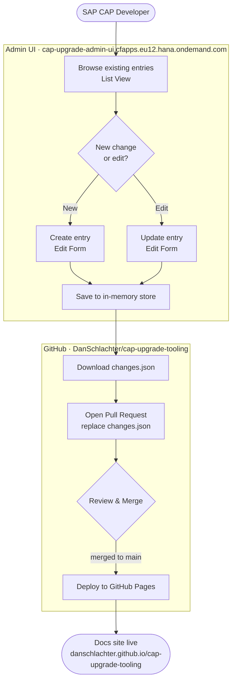
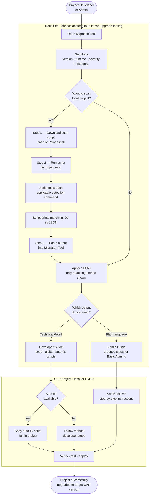
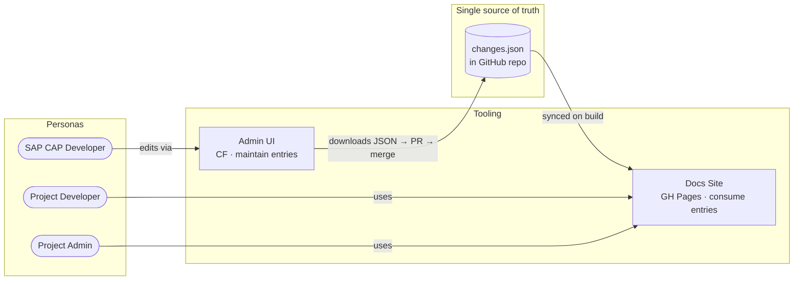

# How It Works

Two separate personas interact with the tooling. The diagrams below show each flow end to end.

---

## Persona 1 — SAP CAP Developer (Maintaining the Knowledge Base)

A CAP expert discovers and documents breaking changes between CAP versions, keeps the knowledge base current, and publishes it so project teams can consume it.

---

## Persona 2 — Project Developer / Admin (Upgrading a CAP Project)

A project team prepares to upgrade their CAP application. They use the docs site to understand what applies to them, scan their project to find affected areas, and act on the results.

---

## System Overview

